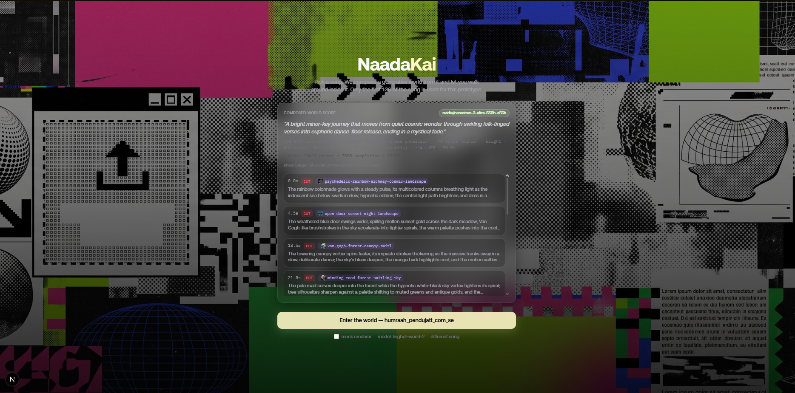
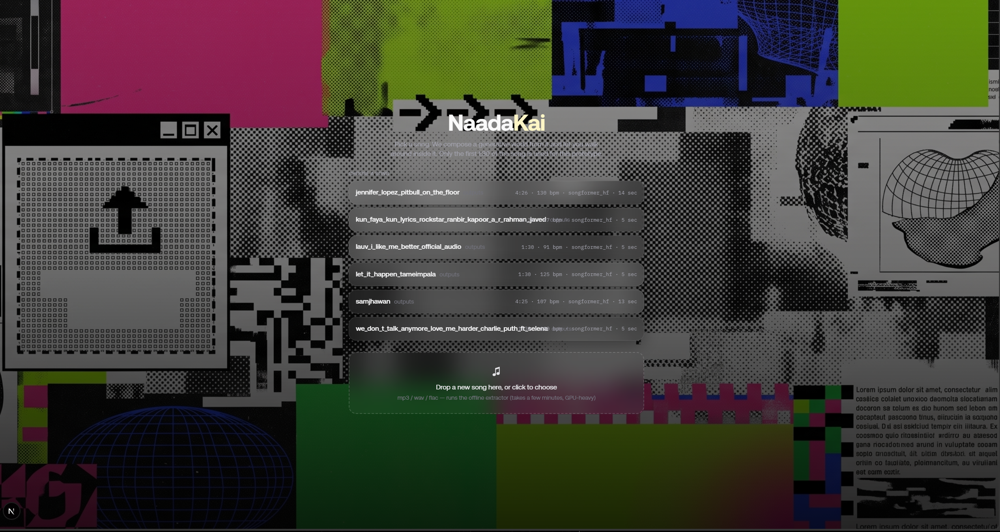

# Song Worlds

Turn a song into a place you can walk through. You upload a track, and the
app builds a generative 3D world out of the song's mood and energy, then
streams that world live with
[`reactor/lingbot-world-2`](https://docs.reactor.inc/model-api-reference/lingbot-world-2/overview)
so you can look and move around inside it while the track plays.

The world is always abstract: nature, cosmos, light, color, weather,
motion. It never tries to literally illustrate the lyrics (a line about
"fire" does not spawn flames).

<p align="center"></p>

This example is worth reading even if you don't care about music, because
it shows a general pattern for real-time generative video: write the whole
plan before you start playing, and never let anything live change that
plan.

- The world's entire script (what it looks like, and when it changes) is
  written once, offline, before playback starts. Nothing that happens
  during playback (not a beat, not a mouse click, not the language model)
  is allowed to change what the world fundamentally is.
- Turning a song's raw audio data into something a language model can
  reason about happens in a separate, deterministic step first. The model
  never sees the raw data, only a short summary of it.
- The parts of the experience that need to feel instant (glow and color
  effects reacting to the beat, mouse look) are kept completely separate
  from the part that decides world content. They never talk to each other.
- The pre-written plan is scheduled onto the video model's own internal
  clock, not onto a `requestAnimationFrame` timer, so it survives real
  playback hiccups.

## Demo

The song picker screen, before a song has been turned into a world:

<p align="center">
  
</p>

Full-bleed screen recordings of the app actually running, with audio
(Lingbot World 2 rendering a composed world live, no UI on top of the
video), are on Google Drive:
[watch the demo recordings](https://drive.google.com/drive/folders/1_FTIz9eVMWbEOcMS13rFltxmHADzf7yn?usp=sharing).

## Run it

You need:

- Node.js 18.18 or newer
- a browser that supports WebGL and WebRTC (any recent Chrome, Firefox, Edge, or Safari)
- a Reactor API key, created from **API Keys** in the [Reactor dashboard](https://reactor.inc/dashboard)
- an NVIDIA API key (free), created at [build.nvidia.com](https://build.nvidia.com). This one is required too: composing a world always calls a language model, and there is no fallback that skips it, even in mock mode.

Clone the repo and set up your environment file:

```bash
git clone https://github.com/reactor-team/reactor-cookbook.git
cd reactor-cookbook/examples/song-worlds
cp .env.example .env.local
```

Open `.env.local` and add your keys:

```dotenv
REACTOR_API_KEY=rk_your_api_key_here
NVIDIA_NEMO_KEY=your_nvidia_nemo_key_here
```

Install and start the app:

```bash
npm install
npm run dev
```

Open [http://localhost:3000](http://localhost:3000). This repo ships no
songs, so the picker screen starts empty. Drop an mp3, wav, or flac file
into the upload panel; it runs an offline analysis step in the background
(a few minutes) and then shows up in the list. See
["Bring your own songs"](#bring-your-own-songs-beatlens) below for details,
including a faster path that skips the in-app upload.

Once a song is picked, the app composes a world for it (one call to an
LLM, usually under two minutes) and shows you the resulting score for
inspection. Click **Enter the world**, then click the video to lock your
mouse for looking around, and press <kbd>Escape</kbd> to release it. Live
world generation uses your Reactor account and may cost money to run;
toggle **mock renderer** on the picker screen if you just want to try the
rest of the pipeline against a free, local, procedurally drawn stand-in.

## Give this to a coding agent

You can hand the entire setup to a local coding agent with a request like:

> Clone `https://github.com/reactor-team/reactor-cookbook.git`. Open
> `examples/song-worlds`, install its dependencies, and create `.env.local`
> without committing it. If `REACTOR_API_KEY` or `NVIDIA_NEMO_KEY` is not
> already available, ask me for it. Start the development server and tell
> me the local URL when it's ready.

Both keys belong only in `.env.local`, or in your host's secret store,
never anywhere else. The browser only ever receives a short-lived, scoped
Reactor session token, never your API key. `NVIDIA_NEMO_KEY` is read in
exactly one place, `POST /api/compose`, and never reaches client-side code
at all.

## How it works

```
song.mp3
   |  offline, once (see "Bring your own songs" below)
   v
BeatLens (github.com/DhruvaMyakeri/BeatLens)
   |  finds stems, beats, downbeats, song sections, chords, key, loudness
   |  writes {song}.meta.json + {song}.features.parquet
   v
Stage 1: deterministic reduction (app/lib/server/summarize.ts, no LLM)
   |  turns the dense numeric data into one compact JSON summary
   v
Stage 2: one language model call (app/lib/server/compose.ts)
   |  the summary, plus a catalog of possible starting images, becomes a
   |  timestamped list of scene changes, i.e. the world's entire script
   v
Playback (app/SongWorldApp.tsx)
   |  the app plays the audio and sends each scripted scene change to
   |  Reactor at the right moment, layers a local audio-reactive effect
   |  on top, and lets you look around with the mouse
   v
a <video> element streaming the live Reactor world, full-bleed
```

Everything above the "Playback" step runs exactly once, on the server,
before the world starts rendering. `POST /api/compose` is the only place a
language model is ever called. Nothing during playback calls it again.

### Stage 1: turning raw numbers into a short summary

BeatLens' dense output table has more than 100 columns (loudness, spectral
shape, and more, repeated across the full mix and four separated audio
stems), sampled 60 times a second. Even a 90 second clip already has
around 5,400 rows. Handing all of that to a language model would blow past
its context window and make it reason worse, not better. So
`buildMusicalSummary()` in `app/lib/server/summarize.ts` first reads only
the twelve columns it actually needs, then reduces those rows into one
small, fixed-shape JSON object, in plain code, with no model call at all.
A few things it does along the way:

- **It normalizes against percentiles, not the literal min and max.** Every
  0 to 1 value (energy, brightness, how often notes attack) is scaled
  against the song's own 5th and 95th percentile, not its absolute lowest
  and highest point. That way one silent intro, or one clipped peak,
  cannot flatten every other part of the song into the same number.
- **It summarizes each song section on its own.** Sections come either
  from BeatLens' own structure detector, or from a simpler fallback that
  looks for sustained shifts in loudness when structure detection was
  turned off. Each section gets an average and peak energy, a brightness
  score, a rate of note attacks, a trend (is it building, dropping, or
  steady), and which instrument seems to dominate it (drums, bass, vocals,
  or none in particular).
- **It finds "notable moments":** sudden jumps or drops in energy, the
  single loudest instant in the clip, and any strong "this is a new
  section" signal. When several of these land close together in time, only
  the strongest one is kept, so a single musical hit doesn't produce a
  cluster of near-duplicate moments.
- **It also computes a few absolute, cross-song-comparable descriptors,**
  separate from the per-song-normalized numbers above: whether the song is
  objectively dark, warm, bright, or brilliant sounding; whether it leans
  more harmonic or more percussive; how much its timbre moves around;
  and a plain description of how much of the song is in a minor versus a
  major chord. These use fixed thresholds instead of the song's own range,
  which is what lets the summary say "this song actually is bright,"
  not just "this part is brighter than the rest of this same song."
- **It never invents a value that doesn't exist.** A song with no clear
  beat keeps its tempo as `null` rather than guessing a number. Silence
  keeps its loudness as `null`. The summary also tells the language model
  whether its section labels mean something musical (like "chorus"),
  are just arbitrary identifiers (like "S3", meaning "don't read anything
  into this name"), or were derived from a simple energy-shift fallback
  because structure detection was off entirely.

The output of this step is called a `MusicalSummary`. It's exactly what
`GET /api/bundles/summary?id=...` returns, and exactly what gets sent to
the language model in Stage 2. See
["What a MusicalSummary looks like"](#what-a-musicalsummary-looks-like)
below for two real examples.

### Stage 2: one language model call, then strict double-checking

`composeWithNemotron()` in `app/lib/server/compose.ts` sends the
`MusicalSummary`, plus the catalog of possible starting images, to
NVIDIA's Nemotron model in a single call, and asks for a JSON object back:
an `interpretation` (a one-sentence description of the song's mood) and a
list of `events`, each one a scene change with a timestamp, a starting
image id, a text prompt, and whether it should be a hard cut or a smooth
morph. This is the entire creative output of the language model. It is
never called again after this.

The app does not trust that response as-is. Everything it returns is
checked and, where needed, corrected, before anything reaches the video
model:

- **Every timestamp is snapped onto a real musical moment.** The app
  collects every section boundary and notable moment from the summary as a
  list of valid "anchors." Any scene change the model proposed gets moved
  to the closest anchor; if nothing is close enough, that scene change is
  dropped entirely. This is what guarantees mood changes land on an actual
  musical transition, rather than wherever the model happened to place
  them.
- **Every starting-image id is checked against the real catalog.** If the
  model returns an id that's slightly off (a typo, a different separator),
  the app looks for the closest real match. If nothing close enough
  exists, it falls back to reusing the previous scene's image rather than
  picking something random.
- **Scene changes that are too close together are merged**, so a burst of
  near-simultaneous changes can't overwhelm playback, and the very first
  scene is always pinned to the start of the song.
- **The model's internal reasoning is thrown away.** Nemotron is a
  "thinking" model that writes out its reasoning before its final answer;
  the app strips that reasoning text out and only keeps the actual JSON
  result, even if the model wrapped it in extra prose.

Nothing after this point re-checks the model's judgment. All of the
double-checking above happens once, right here, not scattered throughout
playback. One finished scene change (called a `WorldEvent`) looks like
this:

```jsonc
{
  "timestamp": 45.96, // snapped onto a real Stage 1 anchor
  "seedId": "van-gogh-forest-canopy-swirl", // checked against the image catalog
  "prompt": "the canopy swirls faster, its blues deepening to indigo...",
  "transition": "morph" // "cut" (new image) or "morph" (same image, prompt only)
}
```

## What a MusicalSummary looks like

`data/summaries/` ships two real `MusicalSummary` files: Stage 1's exact
output for two contrasting songs (the first 90 seconds of each).

- [`let_it_happen_tameimpala.summary.json`](./data/summaries/let_it_happen_tameimpala.summary.json), from Tame Impala's "Let It Happen"
- [`daft_punk_instant_crush.summary.json`](./data/summaries/daft_punk_instant_crush.summary.json), from Daft Punk's "Instant Crush"

This repo ships no audio (see [Asset notes](#asset-notes)), so these two
files exist purely so you can read a real summary without running the
pipeline yourself first. The two songs are close in tempo (125 and 111
beats per minute) and both in a minor key, but Stage 1 still tells them
apart clearly:

| Field | Let It Happen | Instant Crush | What the difference means |
| --- | --- | --- | --- |
| `harmonicPercussiveBalance` | `balanced` | `harmonic-dominant` | Instant Crush has noticeably more sustained, tonal energy relative to drum hits. |
| `spectralMotion` | `flowing` | `restless` | Instant Crush's timbre changes faster from moment to moment. |
| `spectralWidth` | `full` | `wide` | Instant Crush's sound covers a broader range of frequencies at once. |
| `harmonicCharacter` | `"50% minor, A, G#7, F#m, A7"` | `"90% minor, D#m, A#m, F#7, G#7"` | Instant Crush spends much more of its runtime in a minor chord. |
| `notableMoments` | an energy jump at 1s, the loudest instant at 46.2s, another jump at 53.5s | jumps at 1s and 9.5s, loudest instant at 41.9s | These are the candidate moments Stage 2's scene changes are allowed to land on. |

This is exactly the reduction the language model receives, nothing richer
and nothing raw. To see the actual composed world (the seed images,
prompts, and transitions Stage 2 produces from one of these summaries),
extract either track with BeatLens (next section) and compose it through
the running app. `ScorePanel.tsx` renders the result on screen, and it's
also printed in full by `/api/compose`.

## Two world models, one shared interface

`app/lib/world/worldSession.ts` defines a single `WorldSession` interface
with three different implementations behind it. Which one runs is picked
by `WORLD_ENGINE` in `app/lib/world/config.ts`:

- **Helios**, a low-latency model that streams one continuous video.
  Prompts can be swapped mid-stream, and starting images are sent inline
  as base64 data.
- **Lingbot World 2**, a navigable world model with WASD and look
  controls, and this repo's default. Lingbot cannot swap its reference
  image while running, so a "cut" (a change to a new starting image)
  restarts the run behind the scenes (reset, then set the new image, then
  start again); a "morph" (same image, new prompt) stays in the same run
  and is seamless.
- **Mock**, no network calls at all. A simple procedural canvas draws
  particle fields and gradient blobs driven by the same script data, so
  the entire pipeline (upload, compose, render, effects, camera) can be
  tested with zero API keys spent. This is used automatically whenever
  `REACTOR_API_KEY` is not set, and is available as a toggle otherwise.

Every place a real call to Reactor happens is marked `REAL-API SWAP POINT`
in `worldSession.ts`. That's the file to read if you're connecting your
own account, or adding a fourth world model.

### Keeping Lingbot's restarts rare

Every Lingbot "cut" costs a real round trip (reset, then a new image, then
start again), which is visible as a short seam in the video.
`collapseSeeds()` in `app/lib/world/collapseSeeds.ts` limits a composed
world to at most `SEED_MAX_LINGBOT` (3, by default) different starting
images, choosing the most important and best-spread-out ones, and turns
every other scripted scene change into a same-image morph instead. This
keeps the total number of scenes, their order, their timestamps, and their
prompts exactly the same; only which image and transition type each one
uses can change. Cuts also fire `LINGBOT_CUT_LEAD_SEC` (2.5 seconds) early,
to make up for that round trip, so the visible change lands close to the
musical moment instead of noticeably after it.

### Reacting to the beat without breaking the rules (Lingbot)

On every real downbeat (using the actual beat grid BeatLens detected,
played back by `BeatClock`), the app briefly appends a short "intensify"
phrase to whatever prompt is already active, holds it for about 900
milliseconds (long enough to actually show up on screen), then reverts.
That's the entire mechanism behind the world feeling like it's reacting to
the beat: it is still the one pre-written prompt, just briefly turned up,
never a new decision.

A navigable world model will otherwise add its own idle camera drift to
keep the video feeling alive, which is exactly the kind of unplanned
motion this app avoids. So every prompt sent to Lingbot has two fixed
phrases appended to it in `worldSession.ts`, no matter what the language
model wrote: one that locks the camera so it only ever moves in direct
response to the viewer's own mouse or keyboard input, and one that keeps
any visible body or character out of frame, since the viewpoint is meant
to feel bodiless. Both are enforced on the literal text sent to the model,
not left as a suggestion the model could occasionally ignore.

## Data shapes

These are the main shapes of data passed between stages of the pipeline.
Most live in `app/lib/world/types.ts`; `SeedEntry` lives in
`seedCatalog.ts`.

- **`ExtractorMeta`** (and `ExtractorSection`, `ExtractorChord`): BeatLens'
  raw output. Tempo, beats, downbeats, section boundaries, chords, key,
  loudness, and confidence flags. The app checks its version number and
  refuses to read a format it doesn't recognize, rather than silently
  misreading it.
- **`MusicalSummary`**: Stage 1's output. Per-section summaries, notable
  moments, and the absolute descriptors described above. This is the only
  thing Stage 2 ever sees.
- **`WorldEvent`**: one scripted scene change (timestamp, starting image
  id, prompt, transition type), after Stage 2's double-checking.
- **`CompositionResult`**: what `POST /api/compose` returns to the
  browser. The full list of events, the images they use, the summary, the
  rhythm data, the interpretation, and how many tokens the call used.
  Everything the client needs to show the score and run playback.
- **`SeedEntry`**: one entry from the starting-image catalog (id,
  filename, category, one-line description, full description).

## Where to change things

- [`app/lib/world/worldSession.ts`](./app/lib/world/worldSession.ts): the
  `WorldSession` interface (Helios, Lingbot, mock). Add a new model by
  implementing this interface.
- [`app/lib/server/compose.ts`](./app/lib/server/compose.ts) and
  [`app/lib/server/summarize.ts`](./app/lib/server/summarize.ts): the two
  stages described above. Change the composer's system prompt here to
  shift the world's visual style.
- [`app/SongWorldApp.tsx`](./app/SongWorldApp.tsx): the orchestrator. Pick
  a song, compose it, run the scripted playback, tear it down.
- [`app/lib/world/config.ts`](./app/lib/world/config.ts): tunable
  constants (which model to use, camera feel, how strongly the image
  anchors generation, beat-pulse timing).
- [`app/components/world/EffectsOverlay.tsx`](./app/components/world/EffectsOverlay.tsx):
  the local, audio-reactive layer that never talks to Reactor.
- [`seed_images/`](./seed_images): the starting-image catalog. See
  ["Seed images"](#seed-images) below.

`app/demo/`, `app/HeliosApp.tsx`, `app/lib/prompts.ts`, and the
`app/components/*.tsx` files outside `world/` are the original
`create-reactor-app` Helios scaffold this example was built on top of,
kept unchanged and reachable at `/demo` as a plain reference for the base
SDK. See [`skill/SKILL.md`](./skill/SKILL.md) for a full walkthrough of
those patterns.

## Verify changes

```bash
npm run typecheck
npm run build
```

`npm run build` does not start a paid model session or call the language
model. To check live behavior end to end, you need both API keys: compose
a real song, confirm the picker, composing, playing, and ended screens all
show up correctly, and confirm mock mode still works with
`REACTOR_API_KEY` unset.

## Bring your own songs (BeatLens)

This repo ships no audio. The app does no audio analysis of its own; it
only reads the output of [BeatLens](https://github.com/DhruvaMyakeri/BeatLens),
a separate, offline audio analysis tool (stem separation, beat and
downbeat detection, song structure, chords, key, loudness, and dense
per-frame curves) built specifically to feed pipelines like this one.

The easiest way to use it is through the app itself. The upload panel on
the picker screen sends your file to `/api/extract`, which trims it to the
clip length with ffmpeg and runs BeatLens in the background as a
subprocess. If you already have BeatLens installed somewhere, set
`EXTRACTOR_BIN` in `.env.local` to point at it. Otherwise, install it
first:

```bash
# clone it next to this repo, or anywhere; EXTRACTOR_ROOT below just
# needs to point at wherever you put it
git clone https://github.com/DhruvaMyakeri/BeatLens ../beatlens
cd ../beatlens
pip install torch torchaudio --index-url https://download.pytorch.org/whl/cu126
pip install -e .
git clone https://github.com/CPJKU/beat_this models/beat_this_repo
pip install models/beat_this_repo
```

The default `EXTRACTOR_BIN` path assumes a Windows-style virtual
environment (`.venv\Scripts\beatlens.exe`). On macOS or Linux, set
`EXTRACTOR_BIN` in `.env.local` to your virtual environment's binary
instead, typically `.venv/bin/beatlens`.

You can also run BeatLens directly and skip the in-app upload entirely:

```bash
beatlens your_song.mp3 --out outputs
```

That produces `your_song.meta.json` and `your_song.features.parquet`
inside `../beatlens/outputs/`. The app looks for these files in two
places (see `EXTRACTOR_OUTPUT_DIRS` in `app/lib/server/config.ts`):
`outputs/` under `EXTRACTOR_ROOT` (which defaults to `../beatlens`, and
can be changed in `.env.local` if your clone lives elsewhere), and this
repo's own `data/bundles/`, which is gitignored. The fastest way to try a
song locally is copying it and its two output files straight into this
repo:

```bash
mkdir -p data/songs data/bundles
cp your_song.mp3 data/songs/
cp ../beatlens/outputs/your_song.* data/bundles/
```

Either way, the song then appears in the app's picker screen
(`GET /api/bundles`), ready to compose and play. No restart needed beyond
the dev server noticing the new files.

## Seed images

Generating a world from an image needs a starting picture to work from.
`seed_images/` is a flat folder: one image, plus one markdown file with
the same name describing it, per starting image. It's scanned once when
the server starts (`app/lib/server/seedCatalog.ts`) into the menu the
language model picks from when composing a world. If the model returns an
id that doesn't quite match anything in the catalog, the app snaps it to
the closest real one instead of breaking playback.

To add a new starting image, just drop in an image file and a matching
`.md` file with a `**One-liner:**` line describing it. No code changes are
needed. Which category it falls into (`surreal-landscape`,
`party-psychedelic`, or `collage-impressionist`) is guessed from keywords
in that description, or can be set explicitly with a `**Category:**` line.

## Non-goals

These are constraints the code deliberately holds to. Worth knowing before
you extend it:

- The language model is never called during playback. One call, before
  the world starts rendering, produces the entire script.
- Live beats and the video model are never allowed to make live content
  decisions. Beats only drive the local visual effects, and, on Lingbot, a
  brief intensifying of the prompt that's already active. Neither one ever
  produces a new prompt.
- Mouse and keyboard input never reach Reactor. They only ever change
  which direction you're looking (and, on Lingbot, where you are). They
  never trigger a new prompt or a new image.
- The app never sends commands faster than a fixed minimum interval,
  regardless of what triggered them, so nothing can flood the session.
- The song's lyrics and mood shape the *interpretation* the language model
  writes, never a literal illustration. The composer is instructed to
  describe mood and motion (nature, cosmos, light, color, weather), not to
  turn specific words into specific objects.

## Asset notes

`public/images/puppy.jpg` and `public/images/boombox-cat.jpg` ship with
the `create-reactor-app` Helios scaffold this example is built on (see
`app/demo`). `seed_images/` and `public/images/world-bg.png` are curated
for this example. `data/summaries/*.json` are derived numeric analysis
only (tempo, section-level energy and brightness statistics, chord-time
percentages), with no audio, lyrics, or other copyrighted material inside
them. This repo ships no standalone song files at all (see
["Bring your own songs"](#bring-your-own-songs-beatlens)). The images in
`assets/`, and the recordings linked from the Demo section, are original
captures of this app running a live Reactor session.
