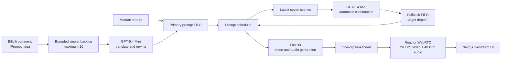

# FastH3 Infinite Livestream

Build an interactive, never-ending video channel with
[FastH3 Preview v1](https://huggingface.co/FastVideo/FastVideo-FastH3-4-step-Preview-v1-VSA-DataFree),
[Reactor](https://docs.reactor.inc), Bilibili live chat, and an LLM story
writer.

FastH3 generates 768p video and synchronized audio from text. The Reactor
model builds one clip ahead while the current clip plays at a fixed 24 FPS.
Manual prompts and Bilibili viewer requests steer upcoming clips, while
GPT-5.4 Mini extends the latest seven scenes whenever the primary queue needs
more material.

The complete application lives in this directory:

- `fasth3.py` adapts FastVideo generation to a shared Reactor session.
- `fasth3_live_chat.py` receives `!Prompt:` comments from Bilibili.
- `demo/` provides the browser interface, WebRTC playback, prompt controls,
  queue status, and source attribution.
- `fasth3.yaml` configures generation, automatic story writing, and live chat.

## Data flow



The primary FIFO preserves manual and rewritten viewer requests in order.
Viewer activity clears speculative AI continuations that have not reached the
generator. The most recent prompt repeats when both queues are empty, keeping
the channel supplied while the next request arrives.

Every playing clip carries its source:

- `manual` for a prompt submitted from the UI or SDK
- `bilibili` for a live-room request, including the viewer name and original
  comment
- `ai` for an automatic continuation

The frontend presents metadata for the clip on screen, independently from the
lookahead clip being generated.

## Requirements

- The [`reactor` CLI](https://docs.reactor.inc/deploy/platform/installation)
  and Docker with the NVIDIA Container Toolkit
- Eight NVIDIA B200 GPUs and CUDA 13
- Approximately 148 GB for the FastH3 checkpoint, plus space for the built
  image and compilation cache
- An [OpenRouter](https://openrouter.ai/) API key for GPT-5.4 Mini
- A Bilibili live-room ID when live-chat control is enabled

The deployment manifest is defined in [`reactor.yaml`](./reactor.yaml). See
the Reactor [build configuration](https://docs.reactor.inc/deploy/platform/build)
for supported manifest fields.

## Download the model

Install the Hugging Face CLI and place the snapshot under Reactor's weights
root:

```sh
FASTH3_WEIGHTS="$HOME/.cache/reactor_registry/fasth3"

hf download FastVideo/FastVideo-FastH3-4-step-Preview-v1-VSA-DataFree \
  --local-dir "$FASTH3_WEIGHTS/FastVideo-FastH3-4-step-Preview-v1-VSA-DataFree"
```

The resulting layout is:

```text
~/.cache/reactor_registry/fasth3/
└── FastVideo-FastH3-4-step-Preview-v1-VSA-DataFree/
    ├── modular_model_index.json
    ├── transformer/
    ├── text_encoder/
    ├── tokenizer/
    ├── processor/
    ├── vae/
    ├── audio_vae/
    ├── scheduler/
    └── audio_scheduler/
```

`load()` validates the complete bundle before loading it and warms the clip
shapes configured in `inference.warmup_aspects` and `inference.ramp_seconds`.

## Configure story generation

Copy the environment template and provide the OpenRouter key in your shell:

```sh
cp .env.example .env
set -a
. ./.env
set +a
```

The key is read from `OPENROUTER_API_KEY`. Deployments may alternatively mount
it at the `story_writer.api_key_file` path configured in `fasth3.yaml`.

Automatic continuation is configured under `story_writer`:

```yaml
story_writer:
  enabled: true
  model: openai/gpt-5.4-mini
  start_delay_seconds: 20
  queue_target: 2
  history_size: 7
```

Twenty seconds after the channel starts, the writer maintains two future AI
scenes whenever manual and viewer prompts leave room. Each completion receives
the latest seven assigned and queued scenes, follows the FastH3 three-field
prompt format, and advances the story by one visible event.

## Connect Bilibili live chat

Set the live-room ID in `fasth3.yaml`:

```yaml
live_chat:
  enabled: true
  room_id: 123456789
  command_prefix: "!Prompt:"
  max_request_chars: 200
  max_pending: 10
```

A matching comment can be written in Chinese or English:

```text
!Prompt: 海绵宝宝和派大星在水母田发现了一扇发光的门
```

GPT translates the direction to English and expands it into a complete FastH3
scene. Requests are rewritten in arrival order. `max_pending` bounds the total
viewer backlog across comments awaiting rewrite and completed Bilibili prompts
awaiting clip assignment.

## Build and run

From this model directory:

```sh
reactor build
reactor run --gpus all -e OPENROUTER_API_KEY
```

The local runtime serves on `http://localhost:8080` by default. Check readiness
and inspect the generated contract with:

```sh
curl -fsS http://localhost:8080/health
curl -fsS http://localhost:8080/schema
```

Use `--port` to select another backend port:

```sh
reactor run --gpus all --port 18104 -e OPENROUTER_API_KEY
```

## Run the frontend

The browser client uses `@reactor-team/js-sdk` for session control, model
messages, and WebRTC media tracks.

```sh
cd demo
cp .env.example .env
pnpm install --frozen-lockfile
pnpm dev
```

Open [http://localhost:3000](http://localhost:3000). The default backend is
`http://localhost:8080`; set `REACTOR_LOCAL_URL` in `demo/.env` for another
port.

For a production frontend process:

```sh
pnpm build
pnpm start --hostname 0.0.0.0 --port 18105
```

The usual interaction order is:

1. Connect the frontend to the Reactor model.
2. Submit an initial prompt.
3. Select **Start**.
4. Add manual prompts or send `!Prompt:` comments in the configured Bilibili
   room.
5. Leave **Infinite story** enabled for automatic continuation between viewer
   requests.

## Prompt format

FastH3 responds best to a detailed three-part English prompt:

```text
integrated_multimodal_description: <characters, setting, camera, chronological action, and <d>[English] dialogue</d>>
overall_soundscape: <ambient sound, synchronized effects, and dialogue qualities>
non_diegetic_music: <score or None>
```

The story writer and Bilibili rewriter produce this structure automatically.
Manual prompts may use the same form directly. The adapter pads accepted
conditions to a compile-stable 256-token width so prompt changes reuse the
warmed transformer graph.

## Runtime behavior

- FastH3 Preview v1 uses four transformer forwards and 90% sparse video
  attention.
- The default 16:9 canvas is 1344×768.
- The opening ramp produces 124 frames, followed by 345-frame steady-state
  clips.
- Playout uses fixed 24 FPS video and synchronized mono 48 kHz audio.
- One generated clip is held as lookahead, balancing uninterrupted playout
  with responsive prompt changes.
- Independent clips meet at intentional scene cuts. `clip_started` identifies
  each visible boundary.
- Session state is shared by connected viewers, so every client sees the same
  stream and prompt progression.

### Continuity mode (optional, off by default)

Setting `inference.continuity: true` turns the hard-cut channel into one
continuous stream. Every clip after the first is generated FL2VA-anchored on the
previous clip's last frame, and the two are crossfaded at the seam — video in
linear light with complementary weights, audio equal-power — so the picture and
sound carry across clip boundaries instead of cutting. Continuation clips are
colour-matched to clip 0's last frame, so exposure cannot drift across a long
chain. `state_update.continuity` reports whether the channel is stitched, and
`clip_started` then marks where a new prompt's content begins rather than a hard
cut. It is a deployment setting, not a runtime command; continuity uses a shorter
steady clip (`inference.continuity_clip_seconds`, default 5.167 s) and a
`inference.seam_frames`-wide overlap (default 12). Off, the behaviour above is
byte-for-byte unchanged. See `fasth3_seam.py` for the pure-numpy seam math.

## Reactor contract

### Tracks

| Track | Kind | Direction | Format |
|---|---|---|---|
| `main_video` | video | outbound | RGB frames at 24 FPS |
| `main_audio` | audio | outbound | mono PCM at 48 kHz |

### Main commands

| Command | Purpose |
|---|---|
| `set_prompt` | Queue one manual scene; an empty value clears waiting prompts |
| `set_auto_story` | Enable or disable automatic continuation |
| `set_style` | Set a reusable visual suffix for future clips |
| `set_clip_seconds` | Select a supported clip duration |
| `set_seed` | Set the starting seed |
| `set_canvas` | Select `16:9`, `1:1`, `9:16`, or `4:3` while idle |
| `start` | Begin continuous generation and playback |
| `pause` / `resume` | Hold and continue playout |
| `stop` | End the active channel while retaining its conditions |
| `reset` | Restore session defaults and clear queued work |
| `get_state` | Return a complete `state_update` snapshot |

Key messages include `prompt_accepted`, `live_prompt_received`,
`live_prompt_queued`, `auto_prompt_queued`, `clip_started`, `clip_complete`,
and `state_update`. The generated schema at `/schema` is the source of truth for
all fields and command responses.

## Project layout

| Path | Responsibility |
|---|---|
| `fasth3.py` | Reactor model, FastVideo loading, prompt scheduling, generation, and paced playout |
| `fasth3_types.py` | Output tracks and client-facing model messages |
| `fasth3_clip_plan.py` | Valid canvases, durations, and frame geometry |
| `fasth3_session_rules.py` | Command availability for each session state |
| `fasth3_live_chat.py` | Bilibili comment parsing and reconnecting room listener |
| `fasth3.yaml` | Inference, story-writer, live-chat, and weight settings |
| `reactor.yaml` | Reactor model identity, resources, runtime, and build configuration |
| `requirements.txt` | Pinned FastVideo, CUDA, attention, and Bilibili dependencies |
| `demo/` | Next.js livestream interface |
| `tests/` | CPU-only contract, queue, story, and playout tests |

## Verify the workspace

Schema rendering and backend tests run without model weights or GPUs:

```sh
python -m reactor_runtime.schema --path . --out /tmp/fasth3-schema.json
PYTHONPATH=. python -m pytest tests/ -q
```

Verify the frontend with:

```sh
cd demo
pnpm install --frozen-lockfile
pnpm typecheck
pnpm build
```

Local `.env` files, credentials, generated media, model weights, Python caches,
and frontend build products are covered by the repository ignore rules.

## Credits and license

FastH3 Preview v1 and its FastVideo inference stack are provided by
[Hao AI Lab](https://github.com/hao-ai-lab/FastVideo). The checkpoint inherits
the [MiniMax-H3 Community License](https://huggingface.co/MiniMaxAI/MiniMax-H3).
The Reactor adapter and demo are covered by the cookbook's
[Apache 2.0 license](../../LICENSE).
