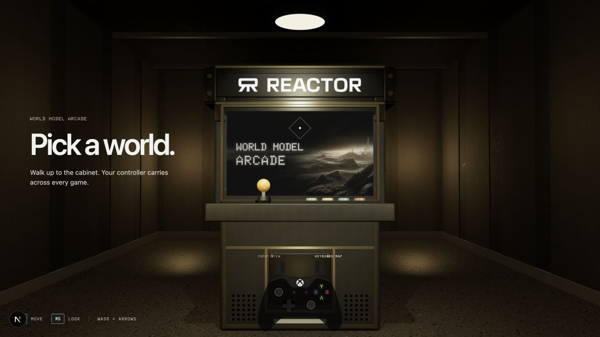

# World Model Arcade

A complete controller-first interface for switching between seven real-time
world-model experiences without leaving a shared 3D arcade. The room, cabinet,
game selector, controller visualization, and HUD run locally; launching a world
starts a live [`reactor/lingbot-world-2`](https://docs.reactor.inc/model-api-reference/lingbot-world-2/overview)
session using that world's reference frame and prompt contract.



The recipe demonstrates more than connecting a video stream. It shows one way
to make a generative experience feel like a product:

- keep the Reactor API key on the server and mint a scoped, short-lived token;
- condition one model with several visual anchors and world contracts;
- translate gamepad and keyboard input into persistent movement state;
- make held face-button actions survive model chunk boundaries;
- drive conventional HUD telemetry immediately from the same controls; and
- audit visual continuity and re-anchor a world when it drifts.

## Run it

You need Node.js 20.9 or newer, a WebGL/WebRTC-capable browser, and a Reactor API
key. Create a key from **API Keys** in the [Reactor dashboard](https://reactor.inc/dashboard).

```bash
git clone https://github.com/reactor-team/reactor-cookbook.git
cd reactor-cookbook/models/lingbot-world-2/arcade
cp .env.example .env.local
```

Put your key in `.env.local`:

```dotenv
REACTOR_API_KEY=rk_your_api_key_here
```

Then install and start the app:

```bash
npm install
npm run dev
```

Open [http://localhost:3000](http://localhost:3000). Walk up to the cabinet,
press <kbd>A</kbd> or <kbd>Enter</kbd>, choose a world, and launch it. Live
world generation uses your Reactor account and may incur usage charges.

## Give this to a coding agent

You can hand the entire setup to a local coding agent with a request like:

> Clone `https://github.com/reactor-team/reactor-cookbook.git`. Open
> `models/lingbot-world-2/arcade`, install its dependencies, and create `.env.local`
> without committing it. If `REACTOR_API_KEY` is not already available, ask me
> for it. Start the development server and tell me the local URL when the arcade
> is ready.

The key belongs only in `.env.local` or the host's secret store. The browser
receives a scoped session token, never the API key.

## Controls

| Input | Arcade | In a world |
| --- | --- | --- |
| Left stick / WASD | Walk, move selection | Move or steer |
| Right stick / arrow keys | Look around | Look; also drives reactive HUD instruments |
| A / Enter or 1 | Use cabinet, launch selection | Primary world action |
| B, X, Y / 2, 3, 4 | Back; X previews a world locally | World-specific quick actions |
| LB, RB / Q, E | Previous / next world | LB toggles diagnostics |
| Menu / P | — | Return to the world's first frame |
| View / Tab or Escape | Step back | Leave the current world |

The controller diagram is interactive. Keyboard input updates it too, so the
demo remains legible while screen recording without a connected gamepad.

## Where to change things

- [`lib/games.ts`](./lib/games.ts) is the content layer. Each entry owns its
  reference frame, identity/camera/environment invariants, movement prompts,
  objective, and four face-button actions.
- [`components/ArcadeExperience.tsx`](./components/ArcadeExperience.tsx) owns the
  session lifecycle, command scheduling, held-action behavior, local telemetry,
  and consistency checks.
- [`components/ArcadeScene.tsx`](./components/ArcadeScene.tsx) builds the
  navigable Three.js room and renders the selector directly onto the cabinet
  screen.
- [`app/api/reactor/token/route.ts`](./app/api/reactor/token/route.ts) exchanges
  the server-side API key for a one-hour token scoped to LingBot World 2.

To add a world, add a 16:9 starting frame under `public/`, then add one entry to
`GAMES`. Be unusually explicit about invariants: describe the subject, camera,
environment, and details that must not change. Quick actions should describe a
complete visible action and its return to the stable pose—not just name an
animation.

## Verify changes

```bash
npm run typecheck
npm run build
```

`npm run build` does not start a paid model session. Live behavior requires the
API key and should be checked with both keyboard and an Xbox-style controller.

## Asset notes

The starting frames and Reactor artwork are included with this example. PBR
surface maps are CC0 assets from ambientCG. The controller art is adapted from
the MIT-licensed Gamepad Viewer project. Doto and IBM Plex Mono are distributed
under the SIL Open Font License. See [`THIRD_PARTY_NOTICES.md`](./THIRD_PARTY_NOTICES.md)
and the license files beside those assets.
