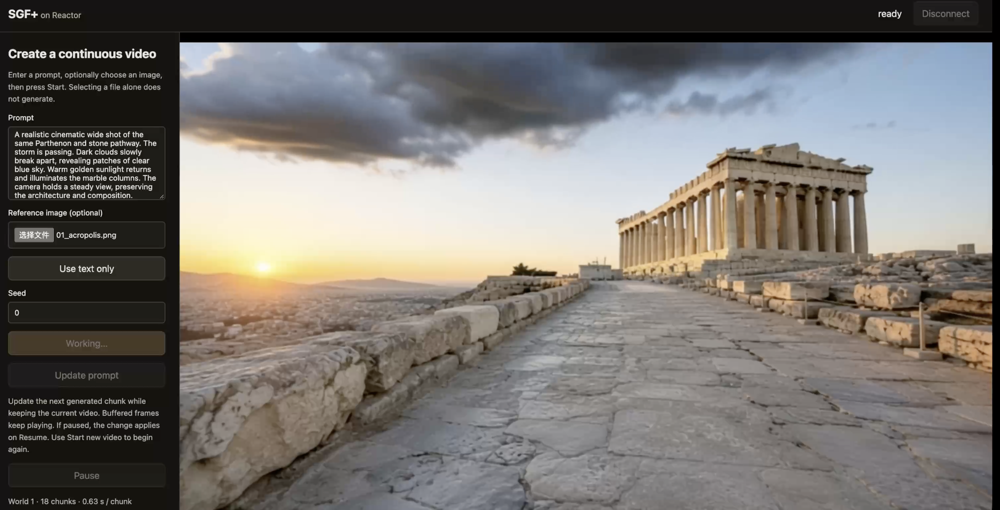

# SGF+ on Reactor

Interactive, streaming [SGF+](https://github.com/Zihan-Su/Self_Gradient_Forcing_Plus),
powered by [Reactor](https://reactor.inc). Describe a scene, optionally upload a reference
image, and watch a continuous video while updating its prompt.



What this integration adds to SGF+:

- **A model service on your GPU.** The [Reactor Runtime](https://github.com/reactor-team/reactor-runtime)
  serves the released chunkwise model to the included browser demo or your own SDK client.
- **Real-time video.** On one B200, steady-state generation measured about 19 FPS at 832×480.
  Playback stays at the original inference export rate of 16 FPS. Startup and the first chunk take longer.
- **Interactive inference.** Start, pause, resume and change the prompt while the video continues,
  using a container built from `reactor.yaml`.

The integration supports two workflows:

| Step | What you get | What it supports |
| --- | --- | --- |
| **1. Run locally** (this README) | A streaming service on your own GPU | Trying the demo, building clients, debugging inference and evaluating continuous rollouts |
| **2. Deploy on Reactor** | A hosted model API, once deployment is configured for your account | Sharing an experience and connecting applications without exposing your GPU machine |

The model's command and video contract is the same in either workflow. This repository's small demo
connects to a local Runtime; a hosted client also needs the SDK's server-side authentication flow.
See the [deployment guide](https://docs.reactor.inc/deploy/overview) when you are ready to publish.

## What you need

- A Linux GPU machine with **one NVIDIA B200**, Docker and the
  [NVIDIA Container Toolkit](https://docs.nvidia.com/datacenter/cloud-native/container-toolkit/latest/install-guide.html).
  The tested configuration uses about 27 GiB of GPU memory.
- About 28 GiB of disk for the inference weights, plus space for the Docker image and build cache.
- Internet access for the initial build and weight downloads.
- On the machine with your browser: this checkout, Node.js 22.12 or later and npm.

In the SGF+ repository, enter `reactor/`. In the Reactor Cookbook, enter
`models/sgf-plus/`. The following commands run from that directory.

## 1. Install the reactor CLI

Choose one installation method:

```sh
# macOS or Linux with Homebrew
brew install reactor-team/tools/reactor-cli

# Alternatively, use the official installer
curl -fsSL https://reactor.inc/install | bash
```

Open a new terminal if the installer updated your PATH. See the
[CLI installation guide](https://docs.reactor.inc/deploy/platform/installation) for details.

**Check:** `reactor version` prints the installed CLI version.

## 2. Get the weights

The first model startup downloads the required files automatically:

- The base model, text encoder, tokenizer and VAE from
  [Wan2.1-T2V-1.3B](https://huggingface.co/Wan-AI/Wan2.1-T2V-1.3B).
- The released `chunkwise/model.pt` checkpoint from
  [Self Gradient Forcing Plus](https://huggingface.co/ZihanSu/Self_Gradient_Forcing_Plus).

The cache is persistent across container restarts. Its default location is declared by
`runtime.weights_path` in [reactor.yaml](reactor.yaml). To use another disk, add
`--weights /path/to/weights` to the run command below. Only inference assets are downloaded;
the upstream training assets and framewise checkpoint are not needed for this recipe.

**Check:** after the first successful startup, the selected weights directory contains
`wan_models/Wan2.1-T2V-1.3B/` and `hf_weights/chunkwise/model.pt`.

## 3. Start the model

```sh
reactor build
reactor run --gpus device=0 --port 8080
```

Select an available GPU on a shared machine. The build installs the pinned upstream source and
Reactor Runtime 3.8.1 inside the container; the host does not need the upstream Python environment.
The initial image build and downloads can take time. Leave the service running in this terminal;
`Ctrl+C` stops it.

**Check:** in another terminal:

```sh
curl -s http://localhost:8080/health
```

Wait for `"state":"available"`; `"state":"loading"` means initialization is still in progress.
If the model exits after an inference error, restart `reactor run`; reconnecting the browser
does not restart a failed model.

## 4. Open the client

On the machine with your browser, open another terminal in the same integration directory:

```sh
cd demo
npm ci
npm run dev
```

Open the URL printed by Vite, normally [http://localhost:5173](http://localhost:5173).
Set **Runtime URL** to `http://localhost:8080`, click **Use endpoint** if you changed it,
then click **Connect**.

Enter a prompt, optionally choose a reference image, set a seed, and click **Start new video**.
Selecting an image only prepares the input; generation waits for Start. Leave the image empty
for text-to-video, or use **Use text only** to clear a selection.

While a video is running, edit the prompt and click **Update prompt**. **Pause** and **Resume**
hold and continue the same video. A prompt changed while paused takes effect after Resume.
Click **Start new video** when you want a fresh rollout from the selected inputs.

**Check:** video appears, the chunk counter advances, and prompt updates keep the same world number.

If the GPU is on another machine, use an address the browser can reach. WebRTC media needs its own
network path: forwarding the HTTP port through SSH alone does not carry video. For SSH-only access,
configure a supported TURN-over-TCP relay and forward its TCP port as well.

<details>
<summary><b>Build your own app with the Reactor SDKs</b></summary>

A client connects to the running model, sends commands, and receives the `main_video` track
and `state_update` messages. The demo uses the official JavaScript SDK.

| SDK | Install / integration | Typical use |
| --- | --- | --- |
| JavaScript / React | `npm install @reactor-team/js-sdk` | Browser interfaces and interactive applications |
| Python | `pip install reactor-sdk` | Evaluation scripts and processing decoded frames as NumPy arrays |
| C++ | Prebuilt library and CMake | Native applications and engines |
| Swift | Swift Package Manager | macOS and iOS applications |
| Java | Java 22+ library | JVM applications |

See [Using the SDK](https://docs.reactor.inc/sdk-reference/using-the-sdk).
The running model exposes its client contract at `GET /schema`.
Read a command's reply from the awaited SDK call; subscribe to `state_update` for shared progress.

For a hosted application, keep API keys on your server and exchange them for session tokens;
follow the [authentication guide](https://docs.reactor.inc/authentication).
The local demo does not include that server-side token exchange.

</details>

## Controls

| Control | Effect |
| --- | --- |
| Prompt | Describe the scene and motion. Required for a new video. |
| Reference image | Optionally condition a new video on a PNG, JPEG, WebP or BMP. No default image is selected. |
| Seed | Choose the seed used by Start new video. |
| Start new video | Begin a fresh rollout from the selected prompt, seed and optional image. |
| Update prompt | Change subsequent chunks while retaining the current video and progress. |
| Pause / Resume | Hold or continue generation without restarting. |
| `reset(seed)` (SDK) | Restart the current prompt and image with a seed. |

SDK commands are `start`, `set_image`, `set_prompt`, `set_paused` and `reset`.
Images are limited to 25 MiB and 40 million pixels, then resized to 832×480. Each accepted
command returns and broadcasts `state_update`; completed chunks broadcast progress and
generation time. Update prompt and Reset require a started video.

Prompt updates take effect on the next generated chunk; already buffered frames play first.
Live prompt editing extends the original single-prompt inference script. Changes can be gradual,
and exact camera motion or a complete scene replacement is not guaranteed. SGF+ has text and
image conditioning; this integration exposes no keyboard-based movement controls.

Each step generates one chunk. Text-only video begins with 9 frames, followed by 12-frame chunks.
Image-conditioned video begins with 9 reconstructed reference frames and 12 generated frames,
then continues with 12-frame chunks. The default horizon is 3,849 frames, about four minutes
at 16 FPS. At completion, start or reset to generate another video.

## Validation

With matched fixed prompts, seeds and inference settings on one B200, native and streamed
inference were compared over **10 consecutive chunks in each mode**: 117 frames for text-to-video
and 129 frames for image-to-video. Maximum absolute differences were **0 for both generated
latents and output RGB pixels** in those tests. This is a measured comparison for those inputs
and lengths, not a guarantee for every prompt, device or rollout.

Dynamic prompt editing was tested separately, including a 30-chunk, three-prompt image-conditioned
rollout through both the SDK and the TURN/TCP browser demo. Generation measured about 19 FPS,
and browser playback was verified at 16 FPS. The released four-step sampler and default memory
settings are retained; this integration adds no quantization or reduced-step sampling.

## More

- **Upstream:** [SGF+ source and research](https://github.com/Zihan-Su/Self_Gradient_Forcing_Plus).
- **Deploy:** [Reactor deployment documentation](https://docs.reactor.inc/deploy/overview).
- **Code map:** `sgf_plus.py` (application commands and hooks), `sgf_plus_model.py`
  (runtime-independent model and step contracts), `sgf_plus_backend.py` (incremental inference),
  `sgf_plus_types.py` (client schema), `sgf_plus_assets.py` (source and weights),
  `sgf_plus_images.py` (upload preprocessing), `sgf_plus.yaml` (settings), and `demo/` (client).
- **Source pin:** the image fetches the upstream commit declared in `reactor.yaml` and checked by
  `sgf_plus_assets.py`. It uses that checkout with the local adapter; edits to sibling upstream
  files are not included in the container automatically.

<details>
<summary><b>Check the adapter without loading the model</b></summary>

From the integration directory, in a Python environment with Reactor Runtime, NumPy, Pillow,
PyYAML and pytest installed:

```sh
python -m reactor_runtime.schema --path . --out /tmp/sgf-plus-schema.json
PYTHONPATH=. python -m pytest tests/ -q
```

The 18 CPU tests exercise application hooks and model-side behavior without Torch, weights
or an upstream checkout.

</details>

## Where this is going

We are bringing autoregressive video models into interactive applications: a local service for
experimentation, and a consistent SDK interface for the applications built around it.
Feedback about SGF+ integration is welcome in this repository; Runtime feedback belongs in the
[Reactor Runtime issue tracker](https://github.com/reactor-team/reactor-runtime/issues).
For collaboration, contact [ruixing@reactor.inc](mailto:ruixing@reactor.inc).

## Credits

Thanks to [Rising0321](https://github.com/Rising0321) for porting SGF+ to Reactor and building the interactive inference demo.

## Licence

The original SGF+ implementation by Zihan Su and collaborators is
[Apache-2.0 licensed](https://github.com/Zihan-Su/Self_Gradient_Forcing_Plus/blob/main/LICENSE).
This integration adapts its inference loop and reuses the original model, including
[Wan2.1](https://github.com/Wan-Video/Wan2.1). Upstream notices and checkpoint licences apply.
